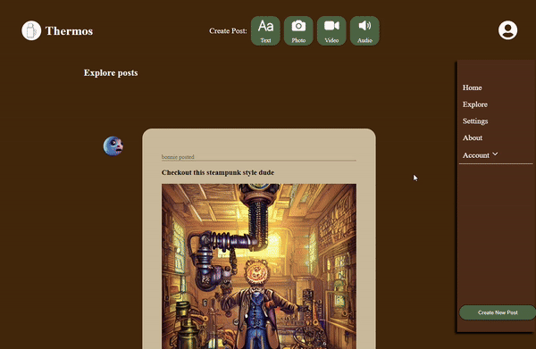
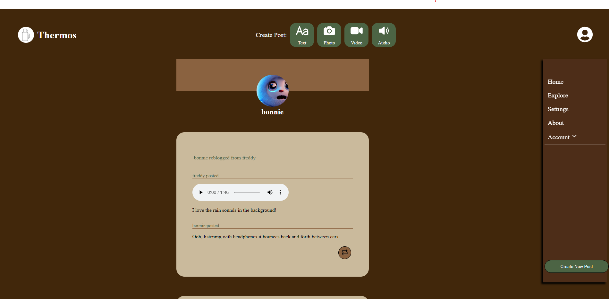
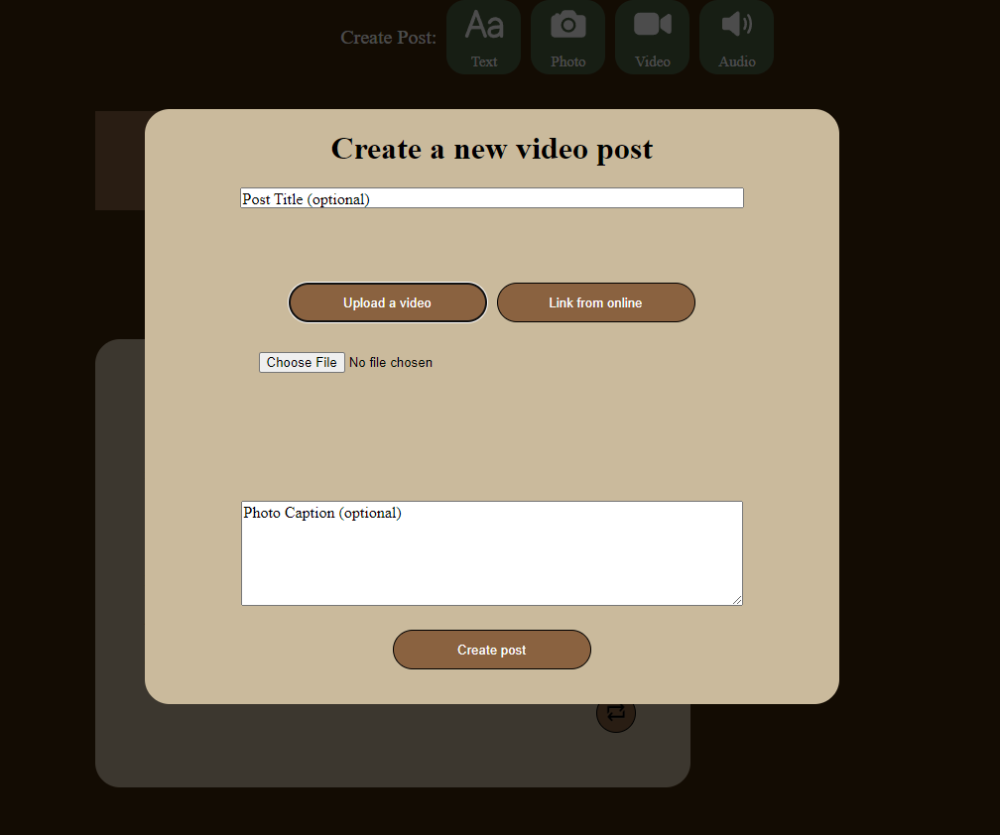
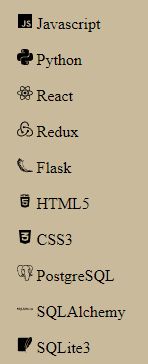

# Thermos

## About the site
Thermos is a cozy, coffee-colored partial-clone of the social media site Tumblr. The main features are the ability to create original posts or 'reblog' posts from other users to share on your own personal blog. Posts can be text, photo, video, or audio, with photo and video also including the ability to use urls from elsewhere online as well as uploading your own files. You also have the ability to add comments or content to existing posts when you reblog, making posts dynamic and ever changing the more they are interacted with.

## Link to live site

https://thermos.onrender.com

## Screenshots







## List of technologies



## How to build site

1. Clone this repository.

2. Install dependencies.

   ```bash
   pipenv install -r requirements.txt
   ```

3. Create a __.env__ file based on the example with proper settings for your
   development environment.

4. Make sure the SQLite3 database connection URL is in the __.env__ file.

5. This starter organizes all tables inside the `flask_schema` schema, defined
   by the `SCHEMA` environment variable.  Replace the value for
   `SCHEMA` with a unique name, **making sure you use the snake_case
   convention.**

6. Get into your pipenv, migrate your database, seed your database, and run your
   Flask app:

   ```bash
   pipenv shell
   ```

   ```bash
   flask db upgrade
   ```

   ```bash
   flask seed all
   ```

   ```bash
   flask run
   ```

7. The React frontend has no styling applied. Copy the __.css__ files from your
   Authenticate Me project into the corresponding locations in the
   __react-vite__ folder to give your project a unique look.

8. To run the React frontend in development, `cd` into the __react-vite__
   directory and run `npm i` to install dependencies. Next, run `npm run build`
   to create the `dist` folder. The starter has modified the `npm run build`
   command to include the `--watch` flag. This flag will rebuild the __dist__
   folder whenever you change your code, keeping the production version up to
   date.

## More information about the site
- [Backend Routes](https://github.com/fbeilke/Thermos/wiki/Backend-API-routes)
- [Database Schema](https://github.com/fbeilke/Thermos/wiki/DB-Schema)
- [Full Features List](https://github.com/fbeilke/Thermos/wiki/Features-List)
- [Starting Wireframes](https://github.com/fbeilke/Thermos/wiki/Starting-WireFrames)
- [User Stories](https://github.com/fbeilke/Thermos/wiki/User-Stories)

## Future implementations

### Completed features
- User Authentication
- Posts
- Reblogs/Comments

### Features in development
- Likes
- Followers
- Tags
- Search
- User settings
## Contact me
[LinkedIn](https://www.linkedin.com/in/fbeilke/)
